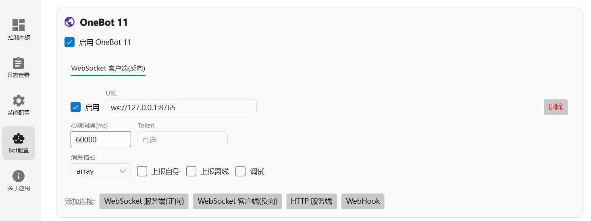

# MangoBot

基于 Spring Boot 的轻量级 QQ 机器人框架，支持 OneBot 协议，提供基于注解的快速开发和插件扩展功能。

## 环境要求

- JDK 17

## 快速开始

1. [下载llonebot](https://github.com/LLOneBot/LuckyLilliaBot/releases)，启动后配置 WebSocket 反向代理，地址为 `ws://127.0.0.1:8765`。  
   

2. 下载本项目 Release 并解压，目录结构如下。在配置文件中按需配置后，点击 `start.bat` 启动程序：

```
MangoBot-cli/
├── plugins         # 插件目录，存放打成 jar 包的插件
├── mangobot.jar    # MangoBot 主程序
├── application.yml # 配置文件
└── start.bat       # 启动脚本
```

3. 发送消息进行验证即可。

## 开发

### 如何接收消息？

在 `org.mango.mangobot.handler` 文件夹下创建你的消息接收类，加上注解 `@MangoBotHandler`，并在消息处理方法上添加注解 `@MangoBotEventListener`，参数使用 `org.mango.mangobot.model.onebot.event` 包下的事件类型即可。

``` java
@MangoBotHandler
public class MessageHandler {
    @MangoBotEventListener
    @PluginPriority(100)
    public boolean onMessage(GroupMessageEvent event) {
        System.out.println("收到消息: " + event.getMessage());
        return true;
    }
}
```

### 如何发送消息？

本项目按照 OneBot 协议实现 API，位于 `org.mango.mangobot.service.OneBotApiService`，直接按参数调用即可。

``` java
SendMessage builder = MessageBuilder.create()
                .text("哈哈")
                .build();
// 可根据返回的 JSON 内容判断是否成功
String json = oneBotApiService.sendGroupMsg(1461626638, 220264051, builder);
```

### 构建项目

``` bash
cd MangoBot-cli
mvn clean package
```

### 运行

``` bash
java -jar target/mangobot-0.0.1-SNAPSHOT.jar
```

## 插件开发

### 创建插件

1. 创建一个新的 Maven 项目。
2. 在 `pom.xml` 同级目录创建 `lib` 文件夹，导入 Release 中提供的 `lib.jar` 包。
3. 在 `pom.xml` 文件的 `<properties>` 标签后插入以下内容：

``` xml
<dependencies>
    <!-- 使用 system scope 引用本地 lib 目录下的 JAR -->
    <dependency>
        <groupId>org.mango</groupId>
        <artifactId>mangobot</artifactId>
        <version>0.0.1-SNAPSHOT</version>
        <scope>system</scope>
        <systemPath>${project.basedir}/lib/mangobot-0.0.1-SNAPSHOT-lib.jar</systemPath>
    </dependency>
</dependencies>

<build>
    <plugins>
        <!-- 打包插件 -->
        <plugin>
            <groupId>org.apache.maven.plugins</groupId>
            <artifactId>maven-shade-plugin</artifactId>
            <version>3.5.0</version>
            <executions>
                <execution>
                    <phase>package</phase>
                    <goals>
                        <goal>shade</goal>
                    </goals>
                </execution>
            </executions>
            <configuration>
                <createDependencyReducedPom>false</createDependencyReducedPom>
            </configuration>
        </plugin>
    </plugins>
</build>
```

4. 在任意位置实现 `Plugin` 接口即可（`onEnable` 方法相当于主函数，业务逻辑将由此执行）：

``` java
public class ExamplePlugin implements Plugin {

    @Override
    public void onEnable(PluginContext context) {
        System.out.println("插件已启用");
    }

    @Override
    public void onDisable() {
        System.out.println("插件已禁用");
    }
}
```

5. **接收和发送消息**：
   - 接收消息：在任意位置使用 `@MangoBotHandler` 和 `@MangoBotEventListener` 注解即可。
   - 发送消息：通过以下方式获取服务实例：

     ``` java
     OneBotApiService oneBotApiService = (OneBotApiService) context.getBean("OneBotApiService");
     ```

6. 打包插件并放入 `plugins` 目录。

## 部分设计

### 事件监听

采用发布-订阅模式，使用 `@MangoBotEventListener` 注解标记事件处理方法。支持的事件类型包括：

- `GroupMessageEvent` — 群消息事件
- `PrivateMessageEvent` — 私聊消息事件
- `MetaEvent` — 元事件（心跳、生命周期）
- `NoticeEvent` — 通知事件

### 优先级

使用 `@PluginPriority` 注解设置监听器优先级，数值越小优先级越高。